## Project: Building an Estimator
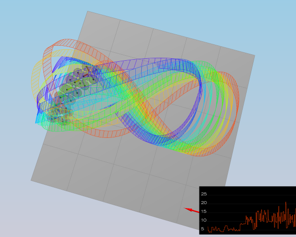

---
# Conclusion
1. The writeup / README should include a statement and supporting figures / images that explain how each rubric item was addressed, and specifically where in the code each step was handled.
---
## Implement Estimator
2. Determine the standard deviation of the measurement noise of both GPS X data and Accelerometer X data. \
The calculated standard deviation should correctly capture ~68% of the sensor measurements. Your writeup should describe the method used for determining the standard deviation given the simulated sensor measurements.

* The numpy np.std() function was used to calculate the standard deviation of the the GPS X signal and the IMU Accelerometer X signal from Graph1.txt and Graph2.txt. The following values where found for GPS: 0.7143 and IMU: 0.4890. These where then set in 06_SensorNoise.txt.

* Below are the standard deviation of the the GPS X signal and the IMU Accelerometer X signal from `06_SensorNoise.txt`:
```
### STUDENT SECTION
MeasuredStdDev_GPSPosXY = .7
MeasuredStdDev_AccelXY = .5
### END STUDENT SECTION
```
3. Implement a better rate gyro attitude integration scheme in the UpdateFromIMU() function. \
The improved integration scheme should result in an attitude estimator of < 0.1 rad for each of the Euler angles for a duration of at least 3 seconds during the simulation. The integration scheme should use quaternions to improve performance over the current simple integration scheme.

* In the UpdateFromIMU function the FromEuler123_RPY function was used for creating a quaternion from Euler Roll/PitchYaw. This is done to get the quaternion needed for the non-linear complimentary filter. The IntegrateBodyRate function was subsequently used to the the predicted_quaternion which contains the predicted pitch, roll and yaw. Finally the yaw is normalized to be between -pi and pi. The code below shows the described steps:

```
// Implement a better integration method that uses the current attitude estimate (rollEst, pitchEst and ekfState(6))
// use the Quaternion<float> class, which has a handy FromEuler123_RPY function for creating a quaternion from Euler Roll/PitchYaw
Quaternion<float> quaternion = Quaternion<float>::FromEuler123_RPY(rollEst, pitchEst, ekfState(6));
```
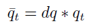
```
// Quaternion<float> also has a IntegrateBodyRate function
// IntegrateBodyRate(const V3D pqr, const double dt)
Quaternion<float> predicted_quaternion = quaternion.IntegrateBodyRate(gyro, dtIMU);

float predictedPitch = predicted_quaternion.Pitch();
float predictedRoll = predicted_quaternion.Roll();
ekfState(6) = predicted_quaternion.Yaw();

// normalize yaw to -pi .. pi
float pi_range = 2.0f * F_PI;
if (ekfState(6) > F_PI) ekfState(6) -= pi_range;
if (ekfState(6) < - F_PI) ekfState(6) += pi_range;
```
4. Implement all of the elements of the prediction step for the estimator. \
The prediction step should include the state update element (PredictState() function), a correct calculation of the Rgb prime matrix, and a proper update of the state covariance. The acceleration should be accounted for as a command in the calculation of gPrime. The covariance update should follow the classic EKF update equation.

* The first of three functions required to do the prediction step for the estimator is the PredictState() function. This function predicts the current state forward by time dt using current accelerations and body rates as input. First an inertial frame vector is generated from the body frame by using Rotate_BtoI(). The predicted state vector is then created from the current state xyz and the inertial_frame_vector xyz all multiplied by the timestep. Finally the predictedState(5) is corrected for gravity.
```
// Use attitude.Rotate_BtoI(<V3F>) to rotate a vector from body frame to inertial frame
// Rotate_BtoI(const V3F& in)
// accel: acceleration of the vehicle, in body frame, *not including gravity* [m/s2]
V3F inertial_frame_vector = attitude.Rotate_BtoI(accel);

// return the predicted state as a vector
// xt = [x, y, z, x_dot, y_dot, z_dot, yaw)
predictedState(0) += curState(3) * dt;
predictedState(1) += curState(4) * dt;
predictedState(2) += curState(5) * dt;
predictedState(3) += inertial_frame_vector.x * dt;
predictedState(4) += inertial_frame_vector.y * dt;
predictedState(5) += inertial_frame_vector.z * dt - 9.81f * dt; //*not including gravity* [m/s2]
// the yaw integral is already done in the IMU update. Be sure not to integrate it again here
```
* The GetRbgPrime() function calculates the partial derivative of the body-to-global rotation matrix. Below is a snippet from the estimation quadrotors paper explaining the rbgprime matrix. The first and second row require some sin and cos calculations and the third row are just zeros.
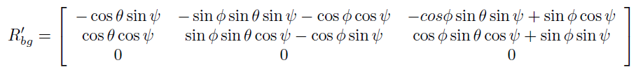
```
RbgPrime(0, 0) = - cos(pitch) * sin(yaw); // -cos pitch sin yaw
RbgPrime(0, 1) = - sin(roll) * sin(pitch) * sin(yaw) - cos(roll) * cos(yaw); // - sin roll * sin pitch * sin yaw - cos roll * cos yaw
RbgPrime(0, 2) = - cos(roll) * sin(pitch) * sin(yaw) + sin(roll) * cos(yaw); // - cos roll * sin pitch * sin yaw - sin roll * cos yaw

RbgPrime(1, 0) = cos(pitch) * cos(yaw); // cos pitch cos yaw
RbgPrime(1, 1) = sin(roll) * sin(pitch) * cos(yaw) - cos(roll) * sin(yaw); // sin roll * sin pitch * cos yaw - cos roll * sin yaw
RbgPrime(1, 2) = cos(roll) * sin(pitch) * cos(yaw) - sin(roll) * sin(yaw); // cos roll * sin pitch * cos yaw + sin roll * sin yaw

RbgPrime(2, 0) = 0.0f;
RbgPrime(2, 1) = 0.0f;
RbgPrime(2, 2) = 0.0f;
```
* After implementing the GetRbgPrime() function, predicting the state covariance forward, is done in the Predict() function. Below is the gprime explaination from the estimation quadrotors paper: \
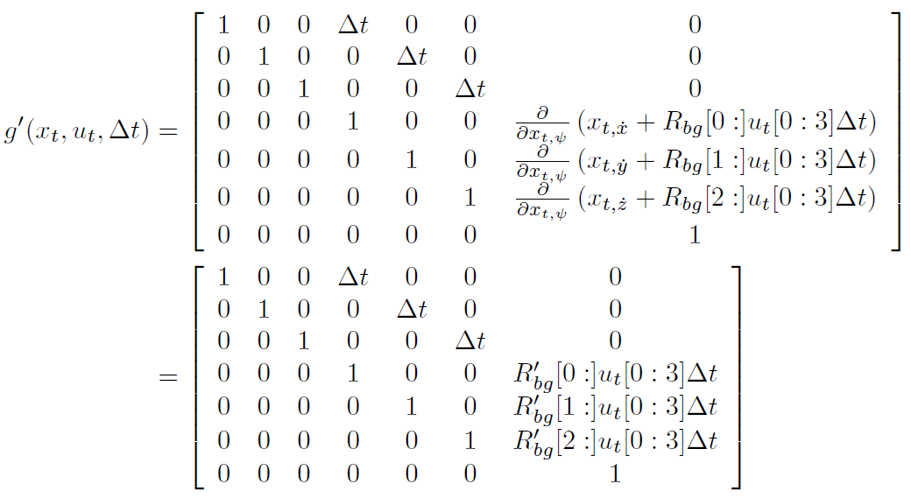
* As seen above, the gprime matrix contains mostly zeros. The one's in the matrix are set using the setIdentity() function. The other 6 required values are (0, 3), (1, 4), (2, 5), (3, 6), (4, 6), (5, 6). The first three need to be set to dt. For the other 3 values, two helper matrixes where used. The first uses the xyz acceleration values. Thereafter the RbgPrime martix is multiplied by this matrix and dt. Then the last three required values in the gprime matrix are set. Finally the covariance matrix is updated according to the EKF equation. (ekfCov = (gPrime * (ekfCov * gPrime.transpose())) + Q;)
```
gPrime(0, 3) = dt;
gPrime(1, 4) = dt;
gPrime(2, 5) = dt;

// g_prime[3:6,5:6] = np.matmul(self.R_bg_prime, (u[:3] * self.dt) )
MatrixXf accel_matrix(3, 1);
accel_matrix(0, 0) = accel.x;
accel_matrix(1, 0) = accel.y;
accel_matrix(2, 0) = accel.z;
MatrixXf g_prime_helper = RbgPrime * accel_matrix * dt;

gPrime(3, 6) = g_prime_helper(0, 0);
gPrime(4, 6) = g_prime_helper(1, 0);
gPrime(5, 6) = g_prime_helper(2, 0);

// update the covariance matrix cov according to the EKF equation.
// process covariance // MatrixXf Q;
// EKF state and covariance // VectorXf ekfState; // MatrixXf ekfCov;
// sigma_bar = np.matmul(G_now, np.matmul(previous_covariance, np.transpose(G_now))) + self.q_t
ekfCov = (gPrime * (ekfCov * gPrime.transpose())) + Q;
```

*  The `QPosXYStd` and the `QVelXYStd` parameters are tuned with the following values:
```
QPosXYStd = 0.1
QVelXYStd = 0.2
```
5. Implement the magnetometer update. \
The update should properly include the magnetometer data into the state. Note that the solution should make sure to correctly measure the angle error between the current state and the magnetometer value (error should be the short way around, not the long way).

* First zFromX is updated with the current estimated yaw. Then the difference between the measured and estimated yaw is calculated and normalized between -pi and pi. Finally hPrime (0, 6) is set to 1.

```
// Your current estimated yaw can be found in the state vector: ekfState(6)
zFromX(0) = ekfState(6);

// difference between your measured and estimated yaw
float difference = magYaw - ekfState(6);
float pi_range = 2.0f * F_PI;

// Make sure to normalize the difference
if (difference > F_PI)
{
zFromX(0) = zFromX(0) + pi_range;
}
else if (difference < - F_PI)
{
zFromX(0) = zFromX(0) - pi_range;
}
```
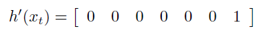
```
// the derivative is a matrix of zeros and ones.
hPrime(0, 6) = 1;
```
*  The `QYawStd` parameter is tuned with the following values:
```
QYawStd = .3
```
6. Implement the GPS update. \
The estimator should correctly incorporate the GPS information to update the current state estimate.

* In this final step first the following values are set in `config/11_GPSUpdate.txt`:
```
Quad.UseIdealEstimator = 0
# SimIMU.AccelStd = 0,0,0
# SimIMU.GyroStd = 0,0,0
```
* Thereafter the UpdateFromGPS() function was implemented. The image below shows what the hprime matrix should look like. This is achieved by using the setIdentity() function on the hprime matrix. finally zFromX is updated with the hprime matrix. \
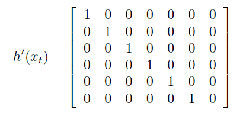
```
hPrime.setIdentity();
zFromX = hPrime * ekfState;
```
## Flight Evaluation
1. For each step of the project, the final estimator should be able to successfully meet the performance criteria with the controller provided. The estimator's parameters should be properly adjusted to satisfy each of the performance criteria elements. /
2. The controller developed in the previous project should be de-tuned to successfully meet the performance criteria of the final scenario (<1m error for entire box flight).

* The controller developed in the previous project did not require any additional tuning to pass the tests. Below is the list of all the used tuning parameters:

```
# QuadEstimatorEKF.txt
QPosXYStd = 0.1
QPosZStd = .05
QVelXYStd = 0.2
QVelZStd = .1
QYawStd = .3

# GPS measurement std deviations
GPSPosXYStd = 2
GPSPosZStd = 6
GPSVelXYStd = .2
GPSVelZStd = .6

# Magnetometer
MagYawStd = .1
```
```
# QuadControlParams.txt
# Position control gains
kpPosXY = 3
kpPosZ = 3
KiPosZ = 30

# Velocity control gains
kpVelXY = 12
kpVelZ = 12

# Angle control gains
kpBank = 12
kpYaw = 4

# Angle rate gains
kpPQR = 80, 80, 10
```

* In all required scenario's the tests are passing, the drone looks stable and performs the required tasks. Below are the test results for all the individual scenario's:

Scenario #1\
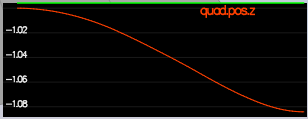
```
(../config/1_Intro.txt)
PASS: ABS(Quad.PosFollowErr) was less than 0.500000 for at least 0.800000 seconds
```
Scenario #2\
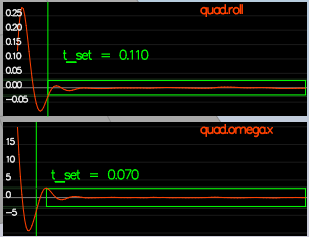
```
(../config/2_AttitudeControl.txt)
PASS: ABS(Quad.Roll) was less than 0.025000 for at least 0.750000 seconds
PASS: ABS(Quad.Omega.X) was less than 2.500000 for at least 0.750000 seconds
```
Scenario #3\
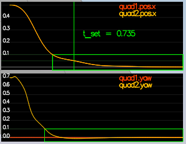
```
(../config/3_PositionControl.txt)
PASS: ABS(Quad1.Pos.X) was less than 0.100000 for at least 1.250000 seconds
PASS: ABS(Quad2.Pos.X) was less than 0.100000 for at least 1.250000 seconds
PASS: ABS(Quad2.Yaw) was less than 0.100000 for at least 1.000000 seconds
```
Scenario #4\
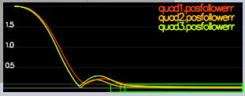
```
(../config/4_Nonidealities.txt)
PASS: ABS(Quad1.PosFollowErr) was less than 0.100000 for at least 1.500000 seconds
PASS: ABS(Quad2.PosFollowErr) was less than 0.100000 for at least 1.500000 seconds
PASS: ABS(Quad3.PosFollowErr) was less than 0.100000 for at least 1.500000 seconds
```
Scenario #5\
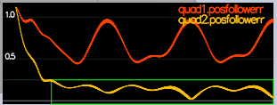
```
(../config/5_TrajectoryFollow.txt)
PASS: ABS(Quad2.PosFollowErr) was less than 0.250000 for at least 3.000000 seconds
```
Scenario #6\
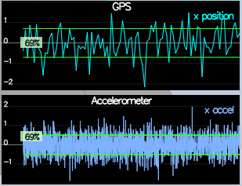
```
(../config/06_SensorNoise.txt)
PASS: ABS(Quad.GPS.X-Quad.Pos.X) was less than MeasuredStdDev_GPSPosXY for 69% of the time
PASS: ABS(Quad.IMU.AX-0.000000) was less than MeasuredStdDev_AccelXY for 69% of the time
```
Scenario #7\
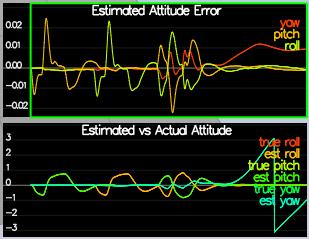
```
(../config/07_AttitudeEstimation.txt)
PASS: ABS(Quad.Est.E.MaxEuler) was less than 0.100000 for at least 3.000000 seconds
```
Scenario #8\
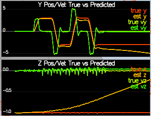
```
(../config/08_PredictState.txt)
```
Scenario #9\
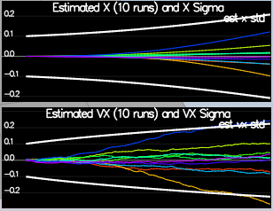
```
(../config/09_PredictCovariance.txt)
```
Scenario #10\
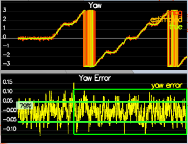
```
(../config/10_MagUpdate.txt)
PASS: ABS(Quad.Est.E.Yaw) was less than 0.120000 for at least 10.000000 seconds
PASS: ABS(Quad.Est.E.Yaw-0.000000) was less than Quad.Est.S.Yaw for 80% of the time
```
Scenario #11\
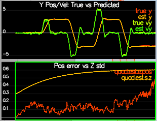
```
(../config/11_GPSUpdate.txt)
PASS: ABS(Quad.Est.E.Pos) was less than 1.000000 for at least 20.000000 seconds
```
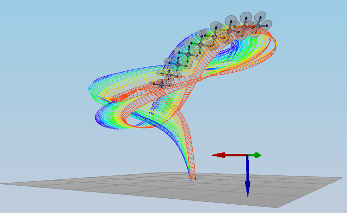
